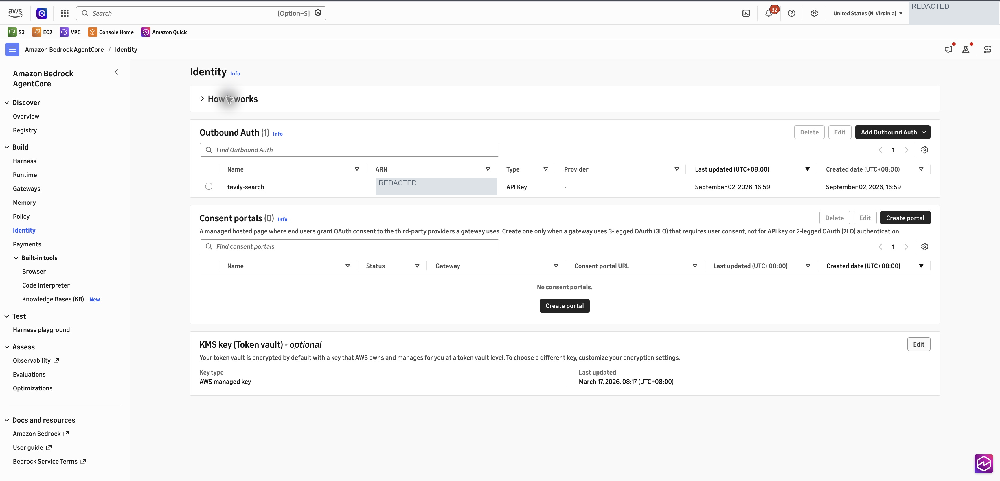
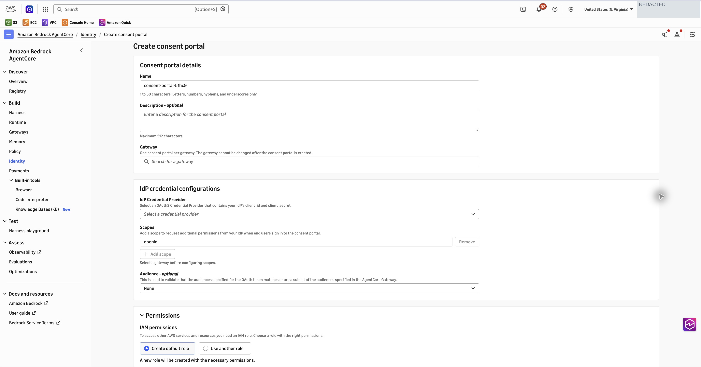
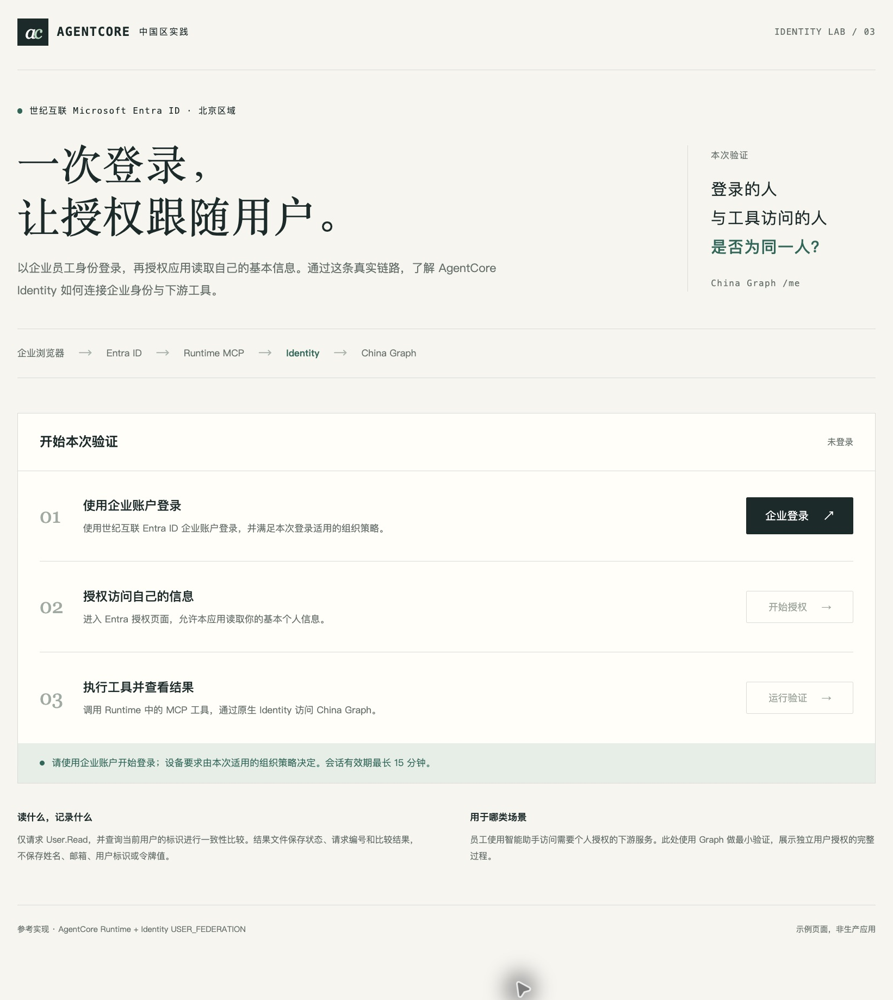
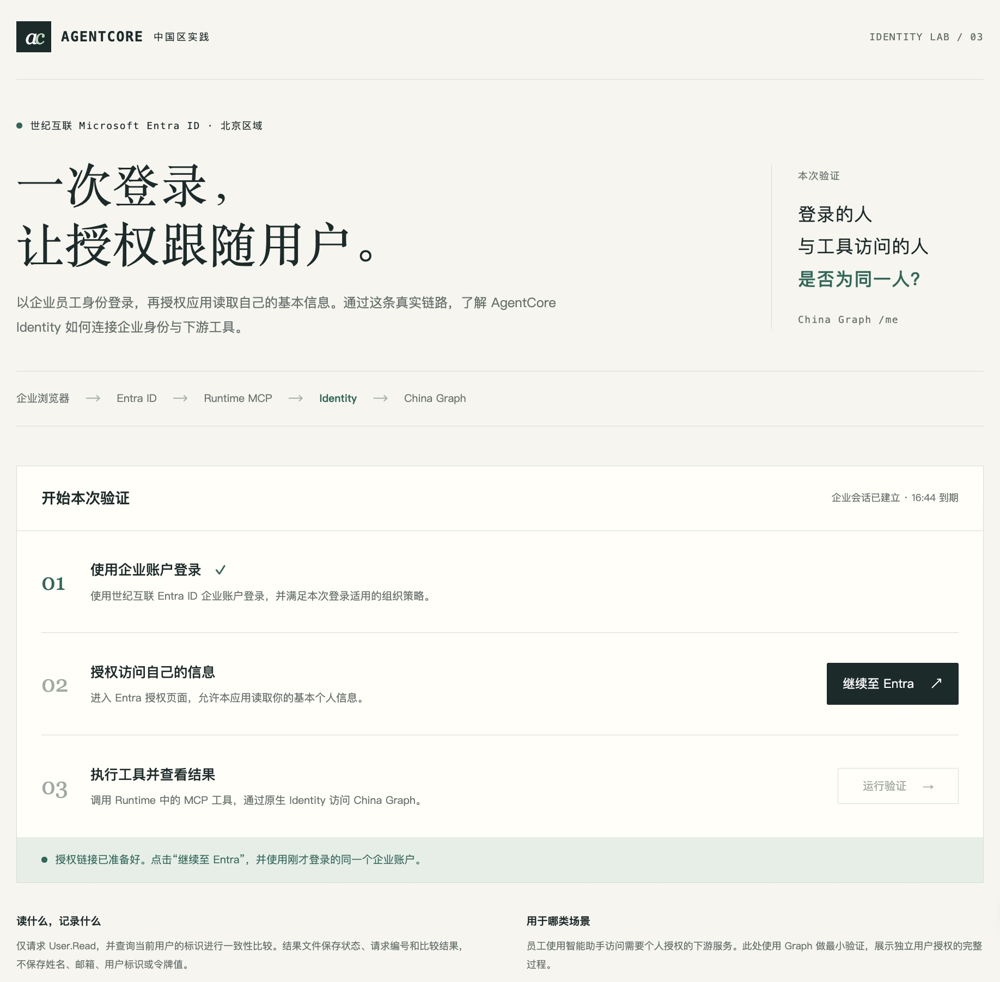
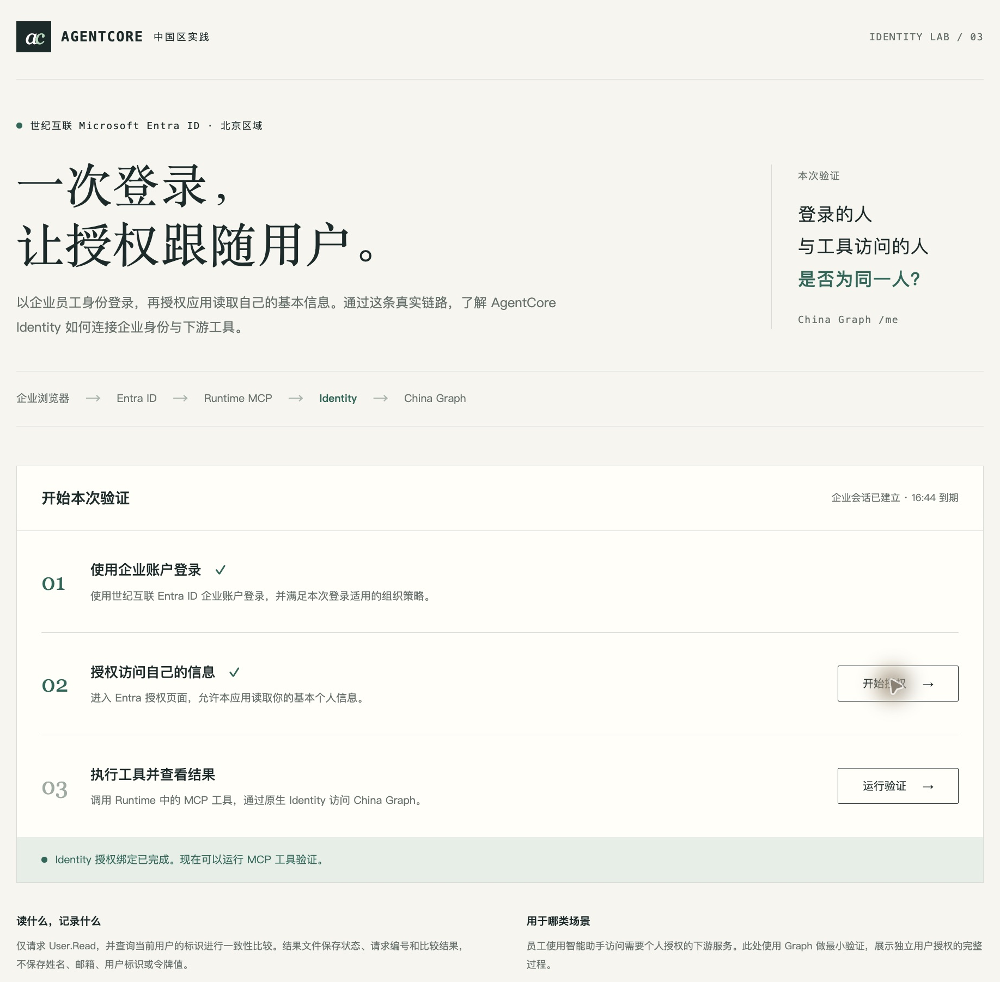
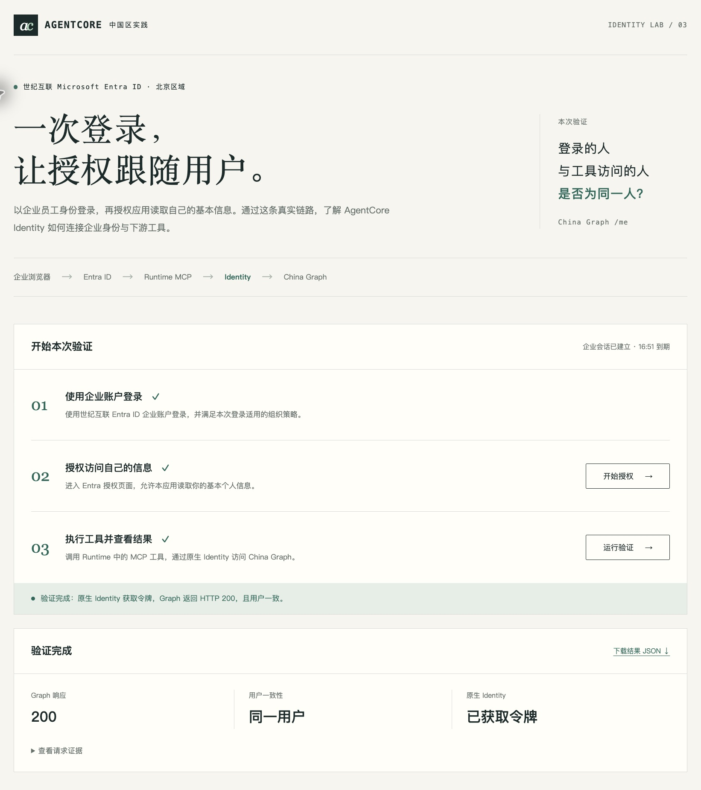

# 全球托管门户与中国区域企业授权页面

本例解决员工在哪里登录、在哪里连接下游账号，以及授权完成后如何继续使用工具。中国区域使用随包的 HTTPS 应用承接这些交互，AgentCore Identity 管理下游 OAuth 令牌，Runtime 调用中国云 Microsoft Graph。

## 全球区域使用托管 Consent portal

在支持该功能的全球区域，先准备 JWT Gateway、与 Gateway 信任相同 OIDC issuer 的主身份 OAuth2 provider，以及门户执行角色。在 AgentCore Identity 的 Consent portals 中选择 Create portal，或从 Gateway 详情页进入创建流程。

选择 Gateway、主身份 provider、登录 scope 与执行角色，创建后等待状态为 `ACTIVE`。把实际返回的 `portalUrl` 加上 `/callback`，登记到主身份应用的 Web redirect URI。

为下游资源创建另一个 OAuth2 provider，把它返回的 `callbackUrl` 登记到下游应用。Gateway target 使用该 provider、`AUTHORIZATION_CODE` 和完整的 `PORTAL_URL/connect/callback`。员工登录托管门户后，在 Connections 中选择对应资源的 Connect，授权后返回已连接状态。

这里的图片是美国东部弗吉尼亚北部区域实际控制台的列表和创建表单；登录后的 Connections 行为按 AWS 官方文档描述。

## 中国区域的替代分工

| 环节 | 本例由谁完成 |
|---|---|
| 员工打开页面、登录和查看状态 | API Gateway HTTPS 入口与 Lambda 页面后端 |
| 当前应用会话和授权事务 | DynamoDB 会话表及后端 Cookie、CSRF 和事务校验 |
| 生成下游授权地址、取得和保管下游令牌 | AgentCore Identity `USER_FEDERATION` |
| 确认授权属于当前登录员工 | 应用回调调用 `CompleteResourceTokenAuth` |
| 代表员工访问 Graph | JWT Runtime 中的 MCP 工具 |

示例提供单个 Graph 连接。已有助手可以集成同一流程；多个连接的展示、管理和业务接口由企业应用继续实现。它不要求先配置 Gateway 托管门户，也不要求 OBO。

## 管理员部署

按[用户委托部署说明](user-delegation-setup.zh-CN.md)第1、2节准备应用、依赖和中国区域资源。使用其中的现成命令录入应用 secret、创建 provider、部署 HTTPS 页面和 Runtime。

在部署状态文件中记录 `portal_url`、`entra_web_redirects` 和 `workload_application_return_url`。把前两条 Web redirects 登记到 Entra；应用 return URL 由部署程序登记到 workload identity。

配套页面由 `samples/mcp-auth/identity_user_static/` 提供，登录和回调由 `identity_user_web.py` 实现，Identity 调用由 `identity_user_core.py` 实现。直接使用示例时无需编写这些代码。

## 员工操作示例

### 企业登录

员工打开管理员提供的 HTTPS 首页。未登录时，授权和工具调用按钮不可用；选择企业登录，在世纪互联 Entra 完成登录后返回应用。后台校验入口令牌，再建立当前应用会话。

### 连接账号

选择开始授权。应用经 Runtime 请求 Identity 的用户授权地址，并把本次事务与当前会话关联。页面出现继续至 Entra 后，使用相同企业账号完成下游授权。已有有效登录或同意时，Entra 可以直接返回。

### 回调绑定

授权流程经 Identity provider callback 返回应用的 `/identity/callback`。应用核对当前会话、`customState` 和授权 session，然后调用 `CompleteResourceTokenAuth`。页面显示授权绑定已完成，工具调用按钮可用。

### 使用工具

选择运行验证。Runtime 从 Identity 取得当前员工的 Graph 令牌，调用 `/v1.0/me?$select=id`。页面显示 Graph 200、同一用户和 Identity 已获取令牌，三个操作步骤都完成。

2026年9月30日，北京区域页面实际完成以上流程。随包[成功结果示例](examples/identity-user-success.example.json)保留该次结果的状态、流程和用户匹配结论，省略请求编号与环境标识。浏览器可以下载本次自己的完整安全结果；其中不导出令牌或用户资料。

结束本次会话会清除当前应用会话。下游已授予的权限按 Entra 和相应资源的授权管理方式维护。

## 集成企业已有页面

把“连接 Microsoft Graph”放进助手的账号设置页，并把授权返回处理接入当前有效应用会话。首次需要个人授权时展示连接入口，绑定完成后继续员工原来的业务请求。

示例使用的后端入口为 `/login`、`/login/callback`、`/authorize`、`/continue`、`/identity/callback`、`/run`、`/api/session` 和 `/result`，均相对于部署输出的 `PORTAL_BASE_URL`。已有前端可以替换页面交互，同时保留身份校验、事务关联、当前会话绑定和下游调用职责。

## 官方资料

- [Consent portal 前置条件](https://docs.aws.amazon.com/bedrock-agentcore/latest/devguide/identity-consent-portal-prerequisites.html)
- [控制台创建 Consent portal](https://docs.aws.amazon.com/bedrock-agentcore/latest/devguide/identity-create-consent-portal-console.html)
- [配置下游连接](https://docs.aws.amazon.com/bedrock-agentcore/latest/devguide/identity-configure-consent-portal-target.html)
- [Identity 用户 OAuth 会话绑定](https://docs.aws.amazon.com/bedrock-agentcore/latest/devguide/oauth2-authorization-url-session-binding.html)
